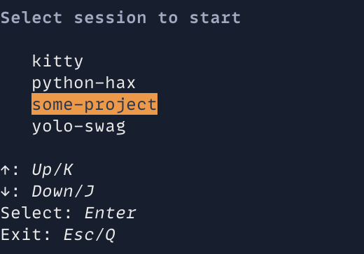

Manage kitty windows similarly to tmux sessions.



# Usage

1. Copy `start_session.py` to `~/.config/kitty/`

   ```
   curl https://raw.githubusercontent.com/muchzill4/kitty-session/master/start_session.py > ~/.config/kitty/start_session.py
   ```

1. Create [kitty session](https://sw.kovidgoyal.net/kitty/overview/#startup-sessions) files in a directory of your choice

1. In `kitty.conf`

   ```
   map key kitten start_session.py "path/to/directory/with/sessions"
   ```

# An alternative approach

FWIW I no longer use this script as I have found, that window management in MacOS'n'kitty makes it hard to achieve tmux-like session flow.
Do not despair! I've been exploring an alternative approach with reasonable success. Inspired by [ThePrimagean's](https://github.com/ThePrimeagen) tmux flow, I now treat each kitty tab as "session". The "session management" is very light weight:

1. Press `<bind>` in kitty to bring up a list of projects in [`fzf`](https://github.com/junegunn/fzf)
1. Confirm project selection.
1. 1. If a kitty tab with given project is already available, focus it.
   1. If a kitty tab with selected project isn't already available, create it and `cd` into directory.

Since I use fish, [here's a fish function](https://github.com/muchzill4/setup/blob/master/dotfiles/fish/.config/fish/functions/kt.fish) that is bound to be [invoked on a keypress in kitty](https://github.com/muchzill4/setup/blob/master/dotfiles/kitty/.config/kitty/kitty.conf#L27).

If I have to manage many processes in a "session", I will split the window and use [zooming](https://github.com/muchzill4/setup/blob/master/dotfiles/kitty/.config/kitty/kitty.conf#L28) to full screen the vim session or whatever else I need to focus on.
